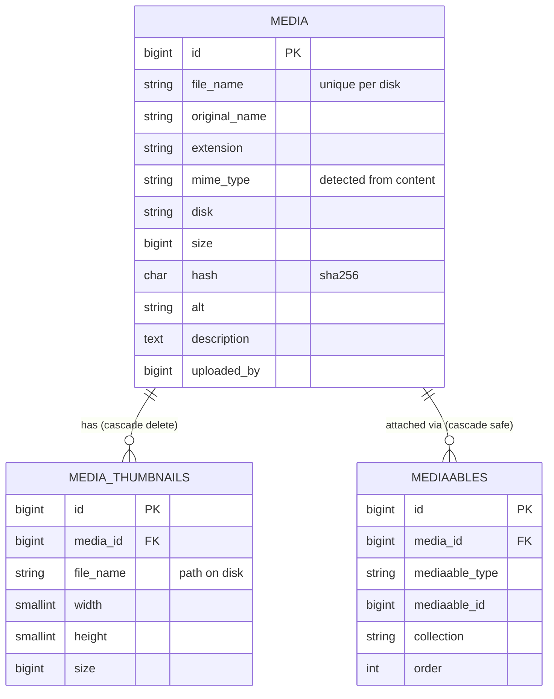

# Media Module

> A production-grade media & file management package for Laravel: polymorphic attachments, race-safe uploads, on-demand thumbnails, a delete lock for referenced files, and an in-place upgrade path for legacy databases.


---

## Why this package exists

This package was extracted from a **live production system with years of accumulated data**. It is built around three constraints:

- **Upgrade, don't rewrite.** A legacy schema is converted in place by an idempotent migration plus a verification command. No manual data fixing.
- **Hosting-agnostic.** Works on shared hosting: no `storage:link`, no symlinks, files served straight from a public disk.
- **Fail-safe by default.** Referenced files can't be deleted, failed uploads leave no orphans, and storage and database stay consistent under concurrency.

## Features

| Area | Details |
|---|---|
| **Uploads** | Any file type, stored on a configurable disk, organized as `{Y-m}/{file_name}.{ext}` |
| **Race-safe naming** | The unique index `(disk, file_name)` is the real lock. On collision, a new name is generated and the insert is retried |
| **Content-based MIME** | MIME type is detected from file content, never trusted from the client |
| **Polymorphic attachments** | `HasMedia` trait: attach to any model, with named **collections** and **ordering** |
| **On-demand thumbnails** | Generated lazily for an allow-list of MIME types, no upscaling, self-healing if the file goes missing |
| **Delete lock** | `isInUse()` blocks deletion while a file is referenced by an attachment or by configured FK columns |
| **Transactional file ops** | Replace, rename and delete keep DB and disk consistent; files are removed only `afterCommit` |
| **Validation** | `AllowedUpload` rule with per-call MIME / extension restrictions and a global deny-list |
| **Placeholders** | File-type-aware fallback icons (by extension, exact MIME, MIME group) for missing files |
| **Swappable models** | Extend `Media` / `MediaThumbnail` in your app and register them via config |
| **Legacy upgrade** | `upgrade` migration and `media:upgrade` command with `--dry-run` reporting |

## Architecture



**Design decisions**

- **Polymorphic pivot** (`mediaables`) instead of per-model FK columns, so any model can own media with no schema change. `collection` and `order` live on the attachment, not on the file.
- **Thumbnails are a cache.** They are rows plus files, rebuilt on demand from the original. Rows that can't be reproduced are safely discarded during upgrades.
- **`thumbnail()` never throws into your view.** On unsupported type, no-upscale or an error, it reports the exception and falls back to the original media.
- **Database constraints over application locks.** Uniqueness of names, attachments and thumbnails is enforced by unique indexes; the application only handles the retry.
- **Storage abstraction.** All I/O goes through `Storage::disk()`, so switching disks is configuration. Each media row stores its own `disk`.

## Requirements

- PHP `^8.1` with `ext-fileinfo` and `ext-gd`
- Laravel `10.x`, `11.x` or `12.x`
- `intervention/image` `^3.0` (installed automatically)

## Installation

```bash
composer require lhaamed/media-module
php artisan migrate
```

Until it is on Packagist, add the repository first:

```json
"repositories": [
    { "type": "vcs", "url": "https://github.com/lhaamed/media-module" }
]
```

```bash
composer require lhaamed/media-module:dev-main
```

The service provider and the `MediaFacade` alias are auto-discovered.

### Publishable assets

```bash
php artisan vendor:publish --tag=media-config       # config/media.php
php artisan vendor:publish --tag=media-migrations   # migrations
php artisan vendor:publish --tag=media-assets       # file-type placeholder icons
php artisan vendor:publish --tag=media-models       # App\Models\Media / MediaThumbnail stubs
```

## Configuration

Define a `media` disk. This example serves files from `public/` and needs no symlink, which suits shared hosting:

```php
// config/filesystems.php
'media' => [
    'driver'     => 'local',
    'root'       => public_path('uploads/media'),
    'url'        => env('APP_URL') . '/uploads/media',
    'visibility' => 'public',
],
```

Main options in `config/media.php`:

| Key | Default | Purpose |
|---|---|---|
| `disk` | `media` (`MEDIA_DISK`) | Default disk for new uploads |
| `disks` | `media` (`MEDIA_DISKS`, comma-separated) | Allow-list of disks uploads may target |
| `hash_filenames` | `false` | Store files under a non-guessable hashed name; the original name stays in the DB |
| `hash_algorithm` | `sha256` | Algorithm for hashed names |
| `blocked_extensions` | `php`, `phtml`, `phar`, `exe`, `sh`, `html`, `svg`, ... | Deny-list enforced by `AllowedUpload` |
| `thumbnailable_mimes` | jpeg, png, gif, webp | Only these types get thumbnails |
| `placeholders` | per extension / MIME group | Fallback icons for missing or non-image files |
| `usages` | `[]` | Extra `table.column` references that lock a file against deletion |
| `models` | package models | Swap in your own `Media` / `MediaThumbnail` classes |

## Usage

### Upload

```php
use lhaamed\MediaModule\MediaFacade;
use lhaamed\MediaModule\Rules\AllowedUpload;

$request->validate([
    'file' => ['required', 'file', new AllowedUpload(mimes: ['image/*'])],
]);

$media = MediaFacade::upload($request->file('file'), [
    'alt' => 'Team photo',
    'description' => 'Annual meetup',
]);
```

### Attach to any model

```php
use lhaamed\MediaModule\Traits\HasMedia;

class Post extends Model
{
    use HasMedia;
}

$post->attachMedia($media, collection: 'cover');
$post->mediaIn('cover')->get();
$post->previewUrl('cover', width: 400);   // thumbnail URL, or a type-specific placeholder
$post->detachMedia($media, 'cover');
```

### Thumbnails

```php
$media->thumbnail(400);          // proportional, 400px wide
$media->thumbnail(400, 300);     // exact 400x300
$media->previewUrl(400);         // image: thumbnail, otherwise: placeholder for its type
```

### Replace, rename, delete

```php
MediaFacade::replace($request->file('file'), $media);   // keeps file_name and URL base
MediaFacade::renameMedia($media, 'New Name');           // slugged, file moved atomically
MediaFacade::deleteMedia($media);                       // throws (409) if the file is in use
```

### Delete protection

```php
$media->isInUse();   // true if referenced in `mediaables` or in config('media.usages')
$media->usages();    // Collection of every reference (type, id, model, source)
```

```php
// config/media.php: protect plain FK columns too
'usages' => ['users.avatar_media_id', 'products.cover_id'],
```

### Customize models

```bash
php artisan vendor:publish --tag=media-models
```

```php
// App\Models\Media
class Media extends \lhaamed\MediaModule\Models\Media
{
    public function usages(): \Illuminate\Support\Collection
    {
        return parent::usages()->concat(/* project-specific checks */);
    }
}
```

```php
// config/media.php
'models' => [
    'media'     => \App\Models\Media::class,
    'thumbnail' => \App\Models\MediaThumbnail::class,
],
```

## Reliability details

- **Upload** reserves the DB row first, then stores the file. If storing fails, the row is removed, so no orphan rows.
- **Replace** stores the new file in a transaction and deletes the old one only after success. Stale thumbnails are invalidated.
- **Rename** runs in a transaction. On failure the DB is rolled back and the in-memory model is restored.
- **Delete** removes thumbnails first and deletes the physical file only after the transaction commits.
- **Thumbnail creation** is concurrency-safe: when a parallel request wins the insert, the existing row is returned and the duplicate file is cleaned up.

## Upgrading from a legacy (v1) schema

Designed for databases where `mime_type` stored the extension and `key` stored an attachment's role:

```bash
# 1. back up the database; the upgrade is one-way
php artisan migrate                    # converts the schema in place
php artisan media:upgrade --dry-run    # report only
php artisan media:upgrade              # fill mime_type / size / hash from real files
```

What the migration does:

- Derives `extension` and a MIME type from the legacy value
- Moves `key` into `mediaables.collection`
- Adopts the legacy `photo_thumbnails` table as `media_thumbnails`
- Switches uniqueness from global to per-disk
- Removes duplicate attachments before adding unique constraints
- Is **idempotent**, so a failed run can simply be repeated

`media:upgrade` options: `--dry-run`, `--force` (reprocess rows that already have a hash), `--chunk=200`. It reports missing files, MIME changes, extensions that don't match content, and blocked extensions.

> Legacy thumbnail files keep their original `-{w}-{h}` names. Newly generated ones use `-{w}x{h}`.

## Security notes

- Always validate uploads with `AllowedUpload`. It checks **every** extension segment, so `shell.php.jpg` is rejected.
- Use `hash_filenames` for non-guessable public URLs.
- The default deny-list also blocks `svg` and `html`, which can carry scripts. Narrow it only if you sanitize them.

## Roadmap

- [ ] Automated test suite
- [ ] Remote disks (S3) for all file operations
- [ ] Queued thumbnail generation

##
